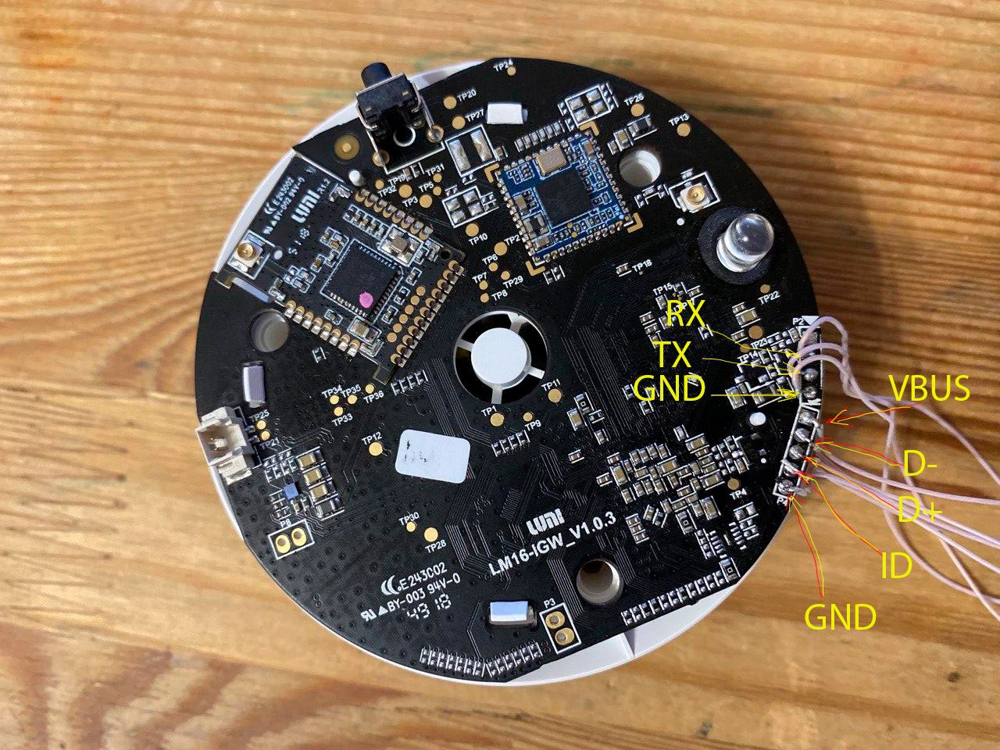
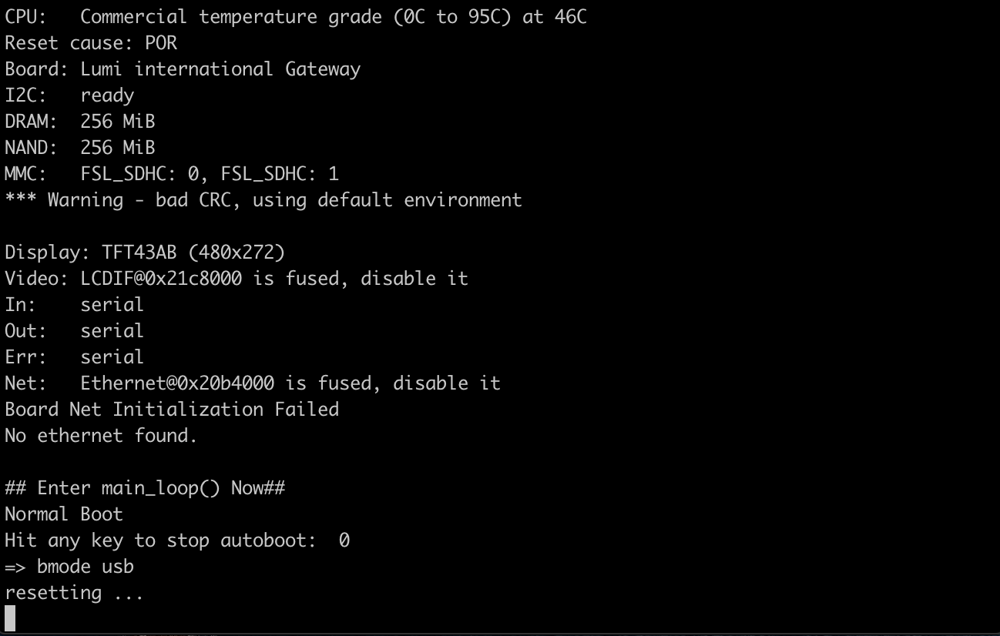

# Установка альтернативной прошивки OpenWrt на шлюз DGNWG05LM

Инструкция относится только к европейской версии шлюза от xiaomi mieu01, 
с европейской вилкой. Для версии xiaomi gateway2 с китайской вилкой она 
не подойдёт, в нём установлены другие аппаратные комплектующие.

Данная инструкция подразумевает, что у вас уже есть доступ ssh к шлюзу.
Если вы это не сделали, воспользуйтесь инструкцией

[https://github.com/dgiese/dustcloud/wiki/Lumi-Aqara-Gateway-Root](https://github.com/dgiese/dustcloud/wiki/Lumi-Aqara-Gateway-Root)

## Резервная копия
Сделайте резервную копию. Если вы решите вернуться на
оригинальную прошивку, для восстановления вам потребуется tar.gz с архивом 
корневой файловой системы.

```shell script
tar -cvpzf /tmp/lumi_stock.tar.gz -C / --exclude='./tmp/*' --exclude='./proc/*' --exclude='./sys/*' .
```

После того, как бэкап сделается, скачайте его на локальный компьютер

```shell script
scp root@*GATEWAY_IP*:/tmp/lumi_stock.tar.gz .
```

или с помощью программы WinScp в режиме `scp`

Если у вас уже есть образ rootfs сделанный через dd, **всё равно сделайте архив**.
На этапе загрузки образа dd обычно возникают ошибки nand flash или ubifs. Вариант
с tar.gz лишён этих недостатков, потому что форматирует флеш перед загрузкой.

## Припаяйте usb + uart

Чтобы провести модификацию прошивки вам потребуется произвести
 аппаратные модификации, припаять 7 проводов к самому шлюзу
- 3 провода на usb2uart переходник (вы это делали на этапе получения рута)
- 4 провода на usb разъём или провод с usb штекером на конце.
 Достаточно припаять 4 провода, +5v, d+, d- и gnd.
 ID провод не задействуется
 Проверьте, что d+ и d- не перепутаны местами, иначе устройство не определится




## Прошивка

Мы подготовили архив с программой mfgtools для загрузки прощивки на шлюз,
а также саму прошивку. В архив включена программа для windows 
и консольное приложение под linux

[Версия 0.1.0rc2](files/mfgtools-rc2.zip)

### Распаковка прошивки

После распаковки архива вам нужно установить драйвера, из папки Drivers.
Чтобы после прошивки шлюз сразу подключился к вашей wifi сети, 
отредактируйте файл
`Profiles/Linux/OS Firmware/files/wpa_supplicant.conf `
и впишите имя и пароль от своей wifi сети.

    network={
            ssid="MyWifi"
            psk="MySecretPassword"
    }

### Подключите шлюз к компьютеру

Нужно подключить шлюз двумя кабелями к компьютеру. UART и USB.
USB на данном этапе не будет определяться в компьютере.
Чтобы подключиться к консоли шлюза, для windows используйте 
программу PuTTY и используйте COM-порт, который появился для usb2uart.
Для linux используйте любую терминальную программу, например
`picocom /dev/ttyUSB0 -b 115200` 


### Перевод в режим загрузки через USB

Для того чтобы перевести в режим прошивки, нужно при старте шлюза в 
консоли на последовательном порту прервать загрузку uboot нажатием 
любой кнопки. У вас будет 1 секунда на это. Появится приглашение для команд

    =>

Далее в командной строке uboot вам надо ввести 

    bmode usb

И нажать enter. 
После этого шлюз перейдёт в режим загрузки по usb и mfgtools сможет обновить
разделы в памяти шлюза.



Запускайте mfgtools.

#### Windows 
В случае windows, у вас откроется окно. Если всё припаяно правильно и драйвера
установлены верно, то в строке в программе будет написано 
HID-compliant device


Нужно нажать кнопку Start для начала прошивки. 

После окончания прошивки, когда полоска прогресса дойдёт до конца, можно нажать
Stop.

#### Linux

Перейдите в папку с прошивкой. Запустите консольную утилиту от суперпользователя

```shell script
sudo ./mfgtoolcli -p 1
```

В псевдографическом интерфейсе будут отображаться этапы прошивки


При подключении шлюза и обнаружении hid устройства, программа сразу начнёт 
процесс прошивки. Если процесс не пошёл, проверьте, что устройство подключено и 
определилось в выводе команды `dmesg`


### Процесс прошивки
Следить за этапами прошивки можно также и в консоли вывода самого шлюза.
По окончанию прошивки в консоли будет выведено 

    Update Complete!


После этого можно перезагружать шлюз. Вытащите его из розетки и воткните обратно.


### Использование OpenWrt

Система настроена таким образом, чтобы сразу подключаться к вашей wifi сети, 
в случае если вы отредактировали wpa_supplicant.conf перед прошивкой.
Если вы ошиблись, отредактируйте параметры в файле `/etc/wpa_supplicant.conf`
уже на устройстве.

# Не забудьте подключить антенны!

Иначе проблемы с подключением к сети обеспечены

На шлюзе предустановлены: 
- Графический интерфейс OpenWrt LuCi на 80 порту http
- Domoticz на 8080 порту
  - Плагин для работы Domoticz с прошивкой Zigbee [Zigate](https://github.com/pipiche38/Domoticz-Zigate)
  - Веб интерфейс по работе с Zigate для domoticz будет доступен по порту 9440
- командная утилита для прошивки zigbee модуля jn5169

Не используйте страницы настройки беспроводных подключений в LuCi, драйвер, который
используется в системе не работает корректно с системой настройки OpenWrt.
Если вы поменяли настройки LuCi и после этого шлюз перестал подключаться к сети,
удалите через консоль файл `/etc/config/wireless`

### Работа с Zigbee

1. [Настройка плагина zigate](./zigate.md)
2. [Установка Zesp32](./zesp32.md)  

### Возврат на стоковую прошивку

Модификация с openwrt затрагивает только изменение корневой файловой системы; 
загрузчик, ядро и dtb остаётся оригинальными. Потому для возврата на сток нужно
прошить оригинальную файловую систему из резервной копии.

Положите файл `lumi_stock.tar.gz` в папку `Profiles/Linux/OS Firmware/files`
рядом с файлом прошивки openwrt и wpa_supplicant.conf
Отредактируйте файл `Profiles/Linux/OS Firmware/ucl2.xml`
текстовым редактором, и замените 

```xml
<CMD state="Updater" type="push" body="pipe tar -zxv -C /mnt/mtd3" file="files/rc2-domoticz-openwrt-imx6-rootfs.tar.gz" ifdev="MX6UL MX7D MX6ULL">Sending and writting rootfs</CMD>
```

на строку с путём к файлу архива с оригинальной прошивкой

```xml
<CMD state="Updater" type="push" body="pipe tar -zxv -C /mnt/mtd3" file="files/lumi_stock.tar.gz" ifdev="MX6UL MX7D MX6ULL">Sending and writting rootfs</CMD>
```

Дальше опять переведите шлюз в режим загрузки по usb и через mfgtools
прошейте оригинальную прошивку. 


## Ссылки

1. Статья, которая подробно описывает изменения технические модификации: 
[Xiaomi Gateway (eu version — Lumi.gateway.mieu01 ) Hacked](https://habr.com/ru/post/494296/)
2. Сборник информации по аппаратному и програмному модингу Xiaomi Gateway [https://github.com/T-REX-XP/XiaomiGatewayHack](https://github.com/T-REX-XP/XiaomiGatewayHack)
2. Телеграм канал с обсуждением модификаций [https://t.me/xiaomi_gw_hack](https://t.me/xiaomi_gw_hack)
