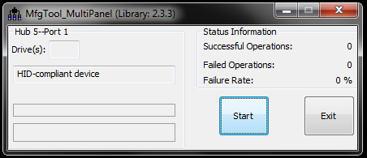
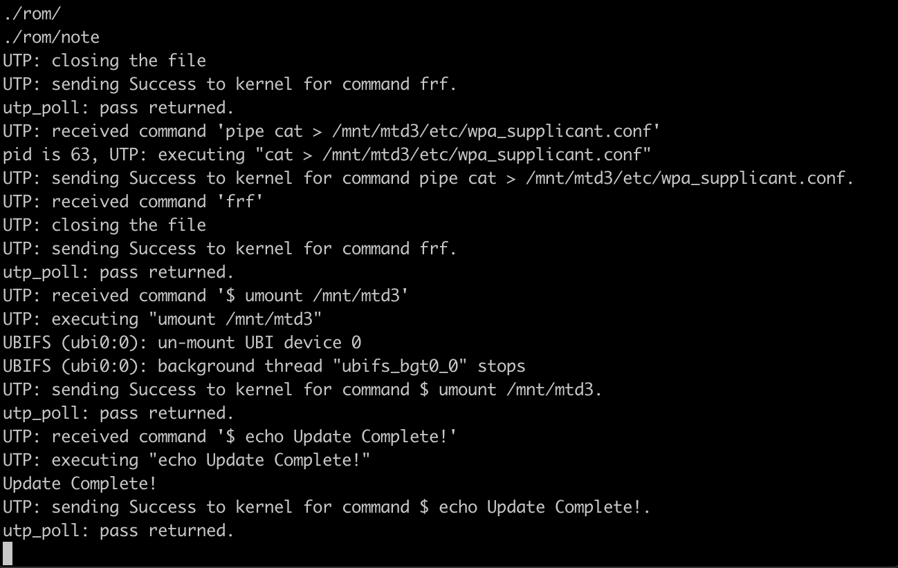

# Flashing over USB

## Solder usb + uart

To modify the firmware you need to make hardware modifications, 
solder 7 wires to the gateway itself
- 3 wires for the usb2uart adapter (you did this at the stage of receiving the root)
- 4 wires per usb connector, or a wire with a usb plug at the end.
 It is enough to solder 4 wires, + 5v, d +, d- and gnd.
 ID contact is not used
 Check that d + and d- are not reversed, otherwise the device will not be detected


## Flashing

We have prepared an archive with the mfgtools program for downloading the firmware to the gateway,
as well as the firmware itself. The archive includes a program for windows
and a console application for linux

[Version 19.07.5 2020-12-17](files/mfgtools-19.07.5-20201217.zip)

### Connect the gateway to your computer

You need to connect the gateway with two cables to your computer. UART and USB.
USB at this stage will not be detected in the computer.
To connect to the gateway console, for windows use
the PuTTY program and use the COM port that appeared for usb2uart dongle.
For linux use any terminal program like
`picocom /dev/ttyUSB0 -b 115200`

### Switch to USB download mode

In order to switch to the firmware mode, you need to start the gateway in
console on the serial port abort uboot by pressing
any button. You will have 1 second for this. A command line prompt will appear

    =>

Then, in the uboot command line, you need to enter

    bmode usb

And press enter.
After that, the gateway will switch to usb boot mode and mfgtools will 
be able to update partitions of the flash memory of the gateway.


If you have Windows, you may need to install drivers from the Drivers folder.

Run mfgtools.

#### Windows 
In case of windows, a window will open. If everything is soldered correctly, 
and the driver is installed properly, the line in the program will show
HID-compliant device


You need to press the Start button to start the flashing.

After the end of the flashing, when the progress bar reaches the end and
turns green, you need to press Stop. If you failed to do that, after a few
minutes, the program will restart the flashing process, and it would lead 
to an error. If that happened, restart the gateway and repeat the 
process starting from the putting the gateway to `bmode usb`.

#### Linux

Go to the firmware folder. Run the console application as superuser

```shell
sudo ./mfgtoolcli -p 1
```

The pseudo-graphic interface will see the stages of the flashing process


When the gateway is connected, and the hid device is detected, the program will
immediately start the flashing process. If the process does not go through, 
check that the device is connected and detected in the output of the `dmesg` 
command.

### Flashing process
You can also follow the firmware stages in the output console of the gateway itself.
At the end of the firmware, the console will display

    Update Complete!



After that, you can reboot the gateway. Unplug it and plug it back in.
Sometimes the gateway hangs on the final stage. If nothing happens for 
5 minutes, then highly likely the flashing process was successfully finished, 
and you can restart the gateway.

# Don't forget to connect the antennas!

Otherwise, problems with connecting to the network are inevitable

